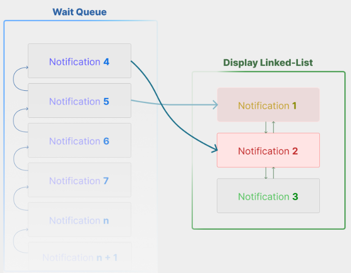

# Open Notifications JS (OPN)

[](https://github.com/kinda-raffy/open-notifications-js/actions/workflows/build-publish.yml/badge.svg?branch=main)

## Brief
A lean yet powerful library for sending in browser-notifications to your users.

Given its robustness, OPN is able to handle a large amount of notifications simultaneously, without cropping/deleting notifications.

It achieves this via a buffered wait queue system, and a special display data structure to neatly display notifications/update notifications.

The below image shows how OPN works.




## Installation

Navigate to the release branch and download `dist/main.js` alongside `main.css`.

Reference both files in your HTML file.

## Usage
To use OPN, you must first create a new instance of the `OpenNotifications` class.

```js
const opn = new OpenNotifications();
```
then, you can use the `add` method to add a notification.

```js
ON.add(
    {
        message: `Hello, World!`, 
        duration: 5000,  // ms
    }
);
```
Currently, the following parameters are supported by the `add` method:
```ts
interface Noti {
    message: string;
    duration: number;              // ms
    backgroundColour?: string;     // css colour
    // For a linear gradient, specify both the start and end colours,
    // otherwise, the start colour will be applied to the whole bar.
    progressColourStart?: string;  // css colour
    progressColourEnd?: string;    // css colour
}
```

## Contributing
Pull requests are very much welcome! For major changes, please open an issue first to discuss what you would like to change.
But otherwise, feel free to make this repo your own.

## License
[MIT](https://choosealicense.com/licenses/mit/)

---

<p align="center">
    
</p>

<center>That is all!</center>
